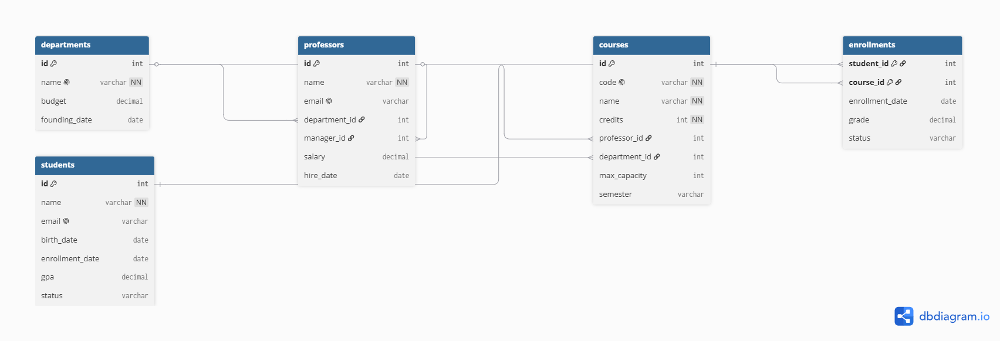
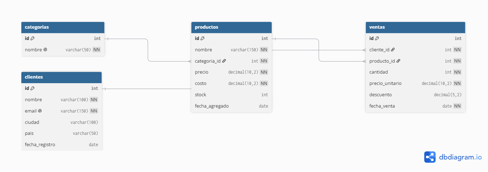

# 🚀 Mi Bootcamp de SQL — Portafolio de Proyectos

¡Bienvenido a mi espacio de aprendizaje! En este repositorio comparto mi evolución técnica semana a semana durante un bootcamp intensivo de SQL de 10 semanas, utilizando **MySQL** y **MySQL Workbench**.

---

## 📅 Índice de Entregas Semanales

<details>
<summary>🎬 <b>Semana 1: Proyecto StreamFlix (Base de Datos y Consultas DQL)</b> <i>[Haz clic para expandir detalles]</i></summary>

### 📝 Descripción del Proyecto
Diseño y explotación analítica de la base de datos relacional de **StreamFlix**, un catálogo de streaming desarrollado desde cero. El sistema gestiona las especificaciones técnicas y comerciales de un catálogo inicial de 15 películas icónicas.

### 🧠 Conceptos Aplicados y Estructura
*   **Arquitectura de Datos (DDL):** `CREATE DATABASE`, `CREATE TABLE` asegurando la integridad mediante restricciones de nulidad (`NOT NULL`), claves primarias automatizadas (`AUTO_INCREMENT`), estados lógicos (`BOOLEAN`) y fechas automáticas (`DEFAULT CURRENT_DATE`).
*   **Inserción de Registros (DML):** Población masiva del catálogo con métricas reales de año, duración, género y calificación.
*   **Explotación Analítica (DQL):** Uso avanzado de filtros de rangos (`BETWEEN`), conjuntos (`IN`), búsquedas parciales (`LIKE` con comodines `%`), eliminación de redundancia (`DISTINCT`) y paginación de datos (`LIMIT`).

### 💻 Consulta Destacada de la Semana
```sql
-- Filtrar películas de Acción o Ciencia Ficción estrenadas en el siglo XXI con nota superior a 8.0
SELECT titulo, genero, calificacion, año
FROM peliculas
WHERE genero IN ('Acción', 'Ciencia Ficción')
  AND calificacion > 8.0
  AND año > 2000
ORDER BY calificacion DESC;
```

### 📐 Decisiones de Ingeniería de Datos Adoptadas
*   **Precisión Métrica:** Elección estricta de `DECIMAL(3,1)` para el campo `calificacion` en lugar de datos de punto flotante (`FLOAT`), evitando errores binarios de aproximación y asegurando exactitud matemática en las notas.
*   **Eficiencia en Almacenamiento:** Uso de `VARCHAR(200)` para los títulos frente al tipo de datos `TEXT`, optimizando el uso de memoria en disco, la velocidad de respuesta de las búsquedas y facilitando la indexación futura.
*   **Gestión Automatizada:** Implementación de `AUTO_INCREMENT` en la Clave Primaria (`id`) para mitigar el riesgo de colisión o duplicidad de identificadores por fallos en cargas manuales.
</details>

<details>
<summary>💻 <b>Semana 2: Proyecto TechStore Inventario (Operaciones CRUD y Transacciones)</b> <i>[Haz clic para expandir detalles]</i></summary>

### 📝 Descripción del Proyecto
Diseño del sistema de control de inventarios y registro de ventas para la plataforma comercial **TechStore**. El objetivo principal fue implementar mecanismos de actualización segura, flujos de auditoría de tiempo y transacciones comerciales atómicas.

### 🧠 Conceptos Aplicados y Estructura
*   **Auditorías e Integridad Temporal:** Implementación de propiedades `TIMESTAMP ON UPDATE CURRENT_TIMESTAMP` para rastrear modificaciones en tiempo real de forma nativa.
*   **Estrategia de Eliminación Lógica (Soft Delete):** Adición dinámica de la columna `deleted_at` mediante sentencias `ALTER TABLE` para marcar registros obsoletos sin destruir el historial analítico.
*   **Mantenimiento Defensivo:** Modificación controlada del estado del motor con `SET SQL_SAFE_UPDATES = 0` garantizando su reactivación inmediata para evitar modificaciones masivas accidentales.
*   **Concurrencia Segura (Propiedades ACID):** Uso de bloques de transacciones (`START TRANSACTION` / `COMMIT`) y captura de estados en variables de sesión (`@precio_actual := precio`).

### 💻 Consulta Destacada de la Semana (Transacción Completa)
```sql
START TRANSACTION;

-- 1. Reducir el inventario del producto (Mouse Pad XL)
UPDATE productos SET stock = stock - 3 WHERE id = 9;

-- 2. Capturar el precio vigente en una variable de sesión
SELECT @precio_actual := precio FROM productos WHERE id = 9;

-- 3. Registrar la venta enlazando la variable calculada dinámicamente
INSERT INTO ventas (producto_id, cantidad, precio_venta, total)
VALUES (9, 3, @precio_actual, @precio_actual * 3);

COMMIT;
```

### 📊 Reportes de Inteligencia de Negocio (BI) Desarrollados
*   **Alerta de Reabastecimiento:** Consulta analítica que calcula dinámicamente las unidades faltantes cruzando el `stock` en tiempo real contra el parámetro `stock_minimo`.
*   **Margen de Rentabilidad:** Análisis financiero que calcula el margen absoluto y el porcentaje de retorno neto (`ROUND`) para identificar el Top 10 de productos con mayor rendimiento.
*   **Revenue por Categoría:** Consolidación de ingresos de la tienda interconectando tablas mediante sentencias `JOIN` junto a funciones de agregación (`SUM`, `COUNT`) agrupadas por departamento de negocio.
</details>

<details>
<summary>🏛️ <b>Semana 3: Proyecto BiblioTech (Relaciones entre Tablas y Diseño Relacional)</b> <i>[Haz clic para expandir detalles]</i></summary>

### 📝 Descripción del Proyecto
Diseño y construcción del sistema de gestión completo para BiblioTech, una biblioteca pública en proceso de digitalización. El sistema gestiona un catálogo de libros con múltiples autores, categorías, usuarios con membresías, préstamos activos y devoluciones con multas. Incluye diagrama ERD, integridad referencial y operaciones transaccionales.

### 🧠 Conceptos Aplicados y Estructura
- **Diseño Relacional (ERD):** Modelado previo en dbdiagram.io con 6 entidades, identificación de cardinalidades (1:N, N:M) y decisión de ubicación de claves foráneas antes de escribir una sola línea de SQL.
- **Integridad Referencial (DDL):** Declaración de FOREIGN KEY con políticas ON DELETE diferenciadas: `SET NULL` para categorías, `RESTRICT` para préstamos y `CASCADE` para la tabla de unión N:M.
- **Relación N:M con tabla pivote:** Implementación de `book_authors` con PRIMARY KEY compuesta `(book_id, author_id)` para modelar libros co-escritos sin duplicar datos.
- **Constraints deterministas (CHECK):** Validación de rangos fijos (`publication_year BETWEEN 1450 AND 2100`, `price > 0`, `stock >= 0`) evitando funciones de fecha dinámica no permitidas en CHECK.
- **Transacciones multi-tabla (ACID):** Operaciones atómicas de préstamo y devolución con `START TRANSACTION / COMMIT`.

### 💻 Consulta Destacada de la Semana (Transacción de Devolución)
```sql
START TRANSACTION;

-- Calcular multa: $2.50 por día de retraso
SET @days_late = (SELECT DATEDIFF(CURDATE(), due_date) FROM loans WHERE id = 6);
SET @fine = GREATEST(0, @days_late * 2.50);

-- Marcar como devuelto y aplicar multa
UPDATE loans SET return_date = CURDATE(), fine = @fine WHERE id = 6;

-- Restituir el ejemplar al inventario
UPDATE books SET stock = stock + 1
WHERE id = (SELECT book_id FROM loans WHERE id = 6);

COMMIT;
```

### 📐 Decisiones de Ingeniería de Datos Adoptadas
- **Política ON DELETE por contexto:** `SET NULL` en `books.category_id`, `RESTRICT` en `loans`, `CASCADE` en `book_authors`.
- **ENUM para listas cerradas:** `ENUM('basic', 'premium', 'vip')` en `users.membership_type` en lugar de VARCHAR + CHECK.
- **Identificadores en ASCII puro:** Nombres de tablas y columnas sin acentos mientras los datos sí conservan acentos (García Márquez).

### 🎁 Bonus implementados (+15%)
- Tabla `reviews` con `CHECK (rating BETWEEN 1 AND 5)` y `UNIQUE (user_id, book_id)`.
- Trigger `tr_price_audit` que registra automáticamente cada cambio de precio.
- Vista `available_books` que cruza 4 tablas y filtra libros con stock disponible.

### 📊 ERD del Sistema


</details>

<details>
<summary>🎓 <b>Semana 4: Proyecto TechMaster University (JOINs)</b> <i>[Haz clic para expandir detalles]</i></summary>

### 📝 Descripción del Proyecto
Diseño y explotación de la base de datos de **TechMaster University**, un sistema académico con departamentos, profesores, estudiantes, cursos e inscripciones. El proyecto cubre los 5 tipos de JOIN sobre un dataset con casos reales de datos incompletos: profesores sin cursos asignados, cursos sin profesor y estudiantes sin ninguna inscripción, resueltos con 15 consultas de negocio.

### 🧠 Conceptos Aplicados y Estructura
- **INNER JOIN:** unión de tablas por FK=PK, quedándose solo con las filas que tienen pareja en ambos lados.
- **LEFT JOIN + patrón de huérfanos:** `LEFT JOIN ... WHERE tabla_derecha.id IS NULL` para detectar filas sin correspondencia (profesores sin cursos, cursos sin profesor).
- **Gotcha ON vs WHERE:** demostración en vivo de cómo un filtro sobre la tabla derecha en `WHERE` en vez de `ON` convierte silenciosamente un LEFT JOIN en un INNER JOIN.
- **SELF JOIN:** relación recursiva `professors.manager_id → professors.id` para modelar la jerarquía profesor-jefe, con desambiguación mediante alias (`p1`, `p2`) y condición `p1.id < p2.id` para evitar duplicados y auto-pares.
- **CROSS JOIN:** producto cartesiano legítimo para generar todas las combinaciones posibles estudiante-curso.
- **JOINs encadenados (N:M):** cruce de hasta 5 tablas a través de la tabla puente `enrollments`, usando `COUNT(DISTINCT ...)` para evitar conteos inflados por el cruce múltiple.

### 💻 Consulta Destacada de la Semana (Reporte Ejecutivo por Departamento)
```sql
SELECT
    d.name AS department,
    COUNT(DISTINCT p.id) AS num_professors,
    COUNT(DISTINCT c.id) AS num_courses,
    COUNT(DISTINCT e.student_id) AS num_students
FROM departments d
LEFT JOIN professors p ON d.id = p.department_id
LEFT JOIN courses c ON d.id = c.department_id
LEFT JOIN enrollments e ON c.id = e.course_id
GROUP BY d.id, d.name
ORDER BY d.name;
```

### 📐 Decisiones de Ingeniería de Datos Adoptadas
- **SELF FK para jerarquías:** `manager_id` referenciando a `professors.id` en lugar de una tabla separada de jefaturas, evitando redundancia estructural.
- **LEFT JOIN por defecto en reportes agregados:** cualquier consulta de tipo "para cada X" (departamento, estudiante) usa LEFT JOIN para no perder entidades sin actividad relacionada.
- **COUNT(DISTINCT) en encadenados multi-tabla:** necesario en cualquier query que cruce 3+ tablas desde un mismo punto, ya que el JOIN multiplica filas antes de agrupar.

### 📊 ERD del Sistema


</details>
<details>
<summary>📊 <b>Semana 5: Proyecto TechMart Analytics (Agregaciones y Agrupamiento)</b> <i>[Haz clic para expandir detalles]</i></summary>

### 📝 Descripción del Proyecto
Dashboard ejecutivo completo para **TechMart Analytics**, un e-commerce con 5 categorías, 24 productos, 20 clientes y 50 ventas en 4 meses. El proyecto produce 14 reportes analíticos listos para presentar a nivel C-suite, cubriendo desde métricas básicas hasta KPIs ejecutivos con cálculo de márgenes, Pareto y crecimiento mensual.

### 🧠 Conceptos Aplicados y Estructura
- **Funciones de agregación:** `COUNT(*)`, `COUNT(DISTINCT)`, `SUM`, `AVG`, `MIN`, `MAX` aplicadas sobre grupos y expresiones calculadas (`cantidad * precio_unitario * (1 - descuento/100)`).
- **GROUP BY:** Agrupamiento por una y múltiples columnas. Regla fundamental: toda columna en SELECT debe estar en GROUP BY o ser agregación.
- **HAVING:** Filtrado de grupos después de agregar. Diferencia clave con WHERE: WHERE filtra filas antes de agrupar, HAVING filtra grupos después.
- **Funciones escalares combinadas:** `ROUND`, `FORMAT`, `CONCAT`, `DATE_FORMAT`, `DATEDIFF`, `COALESCE`, `NULLIF` aplicadas sobre resultados de agregación.
- **CASE WHEN para rangos dinámicos:** Clasificación de descuentos y segmentos de precio sin normalizar datos adicionales.
- **Subconsultas en WHERE y SELECT:** Cálculo de stock promedio y porcentajes sobre el total global.
- **Self-join para crecimiento mensual:** Comparación mes a mes sin window functions, uniendo dos subconsultas de revenue por periodo desplazadas un mes.

### 💻 Consulta Destacada de la Semana (Margen de Ganancia por Categoría)
```sql
SELECT
    c.nombre AS categoria,
    CONCAT('$', FORMAT(SUM(v.cantidad * v.precio_unitario * (1 - v.descuento/100)), 2)) AS revenue,
    CONCAT('$', FORMAT(SUM(v.cantidad * p.costo), 2)) AS costo,
    CONCAT('$', FORMAT(
        SUM(v.cantidad * v.precio_unitario * (1 - v.descuento/100))
        - SUM(v.cantidad * p.costo), 2
    )) AS ganancia,
    CONCAT(ROUND(
        100.0 *
        (SUM(v.cantidad * v.precio_unitario * (1 - v.descuento/100)) - SUM(v.cantidad * p.costo))
        / SUM(v.cantidad * v.precio_unitario * (1 - v.descuento/100)), 2
    ), '%') AS margen_pct
FROM categorias c
JOIN productos p ON c.id = p.categoria_id
JOIN ventas    v ON p.id = v.producto_id
GROUP BY c.id, c.nombre
ORDER BY SUM(v.cantidad * v.precio_unitario * (1 - v.descuento/100)) - SUM(v.cantidad * p.costo) DESC;
```

### 📐 Decisiones de Ingeniería de Datos Adoptadas
- **LEFT JOIN en reportes por categoría:** Para que categorías sin ventas aparezcan con valores nulos en lugar de desaparecer del reporte.
- **NULLIF para evitar división entre cero:** `NULLIF(SUM(p.stock), 0)` en la tasa de conversión protege contra errores en categorías sin stock.
- **COALESCE para NULLs en LEFT JOIN:** `COALESCE(SUM(v.cantidad), 0)` convierte NULLs en ceros cuando un producto no tiene ventas.
- **Patrón de revenue reutilizable:** `cantidad * precio_unitario * (1 - descuento/100)` como expresión estándar para revenue neto, aplicada en los 14 reportes de forma consistente.

### 📊 Reportes del Dashboard (14 + 2 bonus)
| # | Reporte | Insight clave |
|---|---|---|
| R1 | Dashboard general | $7,226.58 revenue · ticket promedio $160.59 |
| R2 | Revenue por categoría | Electrónica lidera con $3,045.17 |
| R3 | Top 10 productos | Mouse Logitech: 17 unidades vendidas |
| R4 | Top 10 clientes | Ana García: $1,327.90 gastado |
| R5 | Revenue por mes | Abril: $2,105.17 — mes con mayor revenue |
| R6 | Margen por categoría | Ropa: 50.39% margen — el más alto |
| R7 | Revenue por país | España lidera con $2,605.10 |
| R8 | Stock bajo el promedio | 8 productos por debajo de 73 uds. promedio |
| R9 | Análisis de descuentos | Rango 10-19% concentra más descuento otorgado |
| R10 | Clientes recurrentes | 5 clientes con 3+ compras |
| R11 | Pareto | Electrónica + Deportes = 65% del revenue |
| R12 | Tasa de conversión | Electrónica: 3.10% — mayor rotación |
| R13 | Crecimiento mensual | Feb -44% · Mar +68% · Abr +9.23% |
| R14 | Resumen ejecutivo | Margen global: 35.93% |
| B1 | Ventas por día | Lunes: más ventas · Viernes: mayor revenue |
| B2 | Productos sin ventas | Refactoring — 55 uds. en stock sin vender |

### 📊 ERD del Sistema


</details>

<details>
<summary>🔍 <b>Semana 6: Proyecto GlobalMart Análisis (Subconsultas y Operadores Avanzados)</b> <i>[Haz clic para expandir detalles]</i></summary>

### 📝 Descripción del Proyecto
Sistema de análisis cruzado para **GlobalMart**, un e-commerce internacional con 5 categorías, 20 productos, 7 clientes y 16 ventas. El proyecto produce 14 reportes analíticos que no se pueden resolver con queries planas — requieren subconsultas escalares, correlacionadas, operadores avanzados y UNION para responder preguntas complejas de negocio.

### 🧠 Conceptos Aplicados y Estructura
- **Subconsultas escalares:** SELECT dentro de WHERE, SELECT y HAVING que devuelve un único valor calculado dinámicamente (AVG, MAX, MIN, SUM).
- **Subconsultas de columna:** Devuelven múltiples filas para usar con `IN` — la lista viene de otro SELECT en lugar de valores hardcodeados.
- **Subconsultas correlacionadas:** La subconsulta interna referencia una columna de la query externa y se ejecuta una vez por cada fila — usadas para comparar cada fila contra el promedio de su propio grupo.
- **Subconsultas anidadas:** SELECT dentro de SELECT dentro de SELECT — calcular el promedio de totales por cliente requiere dos niveles de anidación.
- **Operador IN / NOT IN:** Filtrado por pertenencia a lista dinámica. Trampa crítica: `NOT IN` devuelve 0 filas si la subconsulta contiene algún NULL — siempre filtrar con `WHERE columna IS NOT NULL`.
- **Operador EXISTS / NOT EXISTS:** Verificar existencia de al menos una fila relacionada — más rápido que IN en tablas grandes y no afectado por NULL.
- **Operadores ANY / ALL:** `> ALL` equivale a `> MAX()`, `> ANY` equivale a `> MIN()`. En producción se prefiere la versión explícita con MAX/MIN por claridad.
- **UNION ALL vs UNION:** UNION ALL apila resultados sin verificar duplicados (rápido). UNION elimina duplicados (lento). Usar UNION ALL cuando las queries son disjuntas.

### 💻 Consulta Destacada de la Semana (Clientes que compraron en TODAS las categorías)
```sql
-- Compara categorías distintas compradas por cada cliente vs total de categorías existentes
SELECT cl.nombre
FROM clientes cl
WHERE (
    SELECT COUNT(DISTINCT p.categoria_id)
    FROM ventas v
    JOIN productos p ON v.producto_id = p.id
    WHERE v.cliente_id = cl.id
) = (SELECT COUNT(*) FROM categorias);
```

### 📐 Decisiones de Ingeniería de Datos Adoptadas
- **NOT EXISTS sobre NOT IN en producción:** `NOT EXISTS` es inmune a NULLs en la subconsulta y se detiene al primer match — más seguro y más rápido que `NOT IN` cuando hay riesgo de valores nulos.
- **WHERE producto_id IS NOT NULL en NOT IN:** Cuando `NOT IN` es necesario, filtrar explícitamente los NULLs de la subconsulta interna para evitar resultados vacíos silenciosos.
- **UNION ALL por defecto:** Las queries de las fases de UNION son disjuntas (En stock / Agotado son mutuamente excluyentes), por lo que UNION ALL es correcto y más eficiente que UNION.
- **Paréntesis en UNION con LIMIT:** Sin paréntesis, el LIMIT se aplica al resultado combinado total. Con paréntesis, cada bloque aplica su propio LIMIT antes de unirse.

### 📊 Reportes del Análisis (14 queries)
| # | Reporte | Técnica |
|---|---------|---------|
| R1 | Productos más caros que el promedio global | Subconsulta escalar en WHERE |
| R2 | Clientes que gastaron más que el promedio | Subconsulta anidada en HAVING |
| R3 | Categorías con precio promedio > promedio global | Subconsulta escalar en HAVING |
| R4 | Productos sin ninguna venta | NOT IN con IS NOT NULL |
| R5 | Productos con stock > promedio de su categoría | Subconsulta correlacionada |
| R6 | Clientes con al menos 1 compra en Electrónica | IN con subconsulta |
| R7 | Productos con al menos 1 venta | EXISTS |
| R8 | Clientes sin ninguna compra | NOT EXISTS |
| R9 | Productos más caros que todos los de Ropa | > ALL |
| R10 | Productos más caros que al menos uno de Deportes | > ANY |
| R11 | Catálogo etiquetado por estado de stock | UNION ALL |
| R12 | Top 3 productos más caros por categoría | UNION ALL con LIMIT por bloque |
| R13 | Clientes que compraron en TODAS las categorías | Correlacionada con COUNT DISTINCT |
| R14 | Productos con unidades vendidas > promedio | Subconsulta anidada en HAVING |

</details>

---
