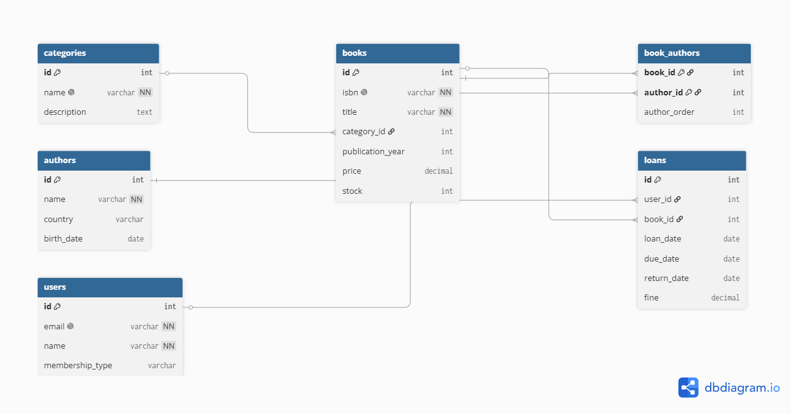

# 🚀 Mi Bootcamp de SQL — Portafolio de Proyectos

¡Bienvenido a mi espacio de aprendizaje! En este repositorio comparto mi evolución técnica semana a semana durante un bootcamp intensivo de SQL de 10 semanas, utilizando **MySQL** y **MySQL Workbench**.

---

## 📅 Índice de Entregas Semanales

<details>
<summary>🎬 <b>Semana 1: Proyecto StreamFlix (Base de Datos y Consultas DQL)</b> <i>[Haz clic para expandir detalles]</i></summary>

### 📝 Descripción del Proyecto
Diseño y explotación analítica de la base de datos relacional de **StreamFlix**, un catálogo de streaming desarrollado desde cero. El sistema gestiona las especificaciones técnicas y comerciales de un catálogo inicial de 15 películas icónicas.

### 🧠 Conceptos Aplicados y Estructura
*   **Arquitectura de Datos (DDL):** `CREATE DATABASE`, `CREATE TABLE` asegurando la integridad mediante restricciones de nulidad (`NOT NULL`), claves primarias automatizadas (`AUTO_INCREMENT`), estados lógicos (`BOOLEAN`) y fechas automáticas (`DEFAULT CURRENT_DATE`).
*   **Inserción de Registros (DML):** Población masiva del catálogo con métricas reales de año, duración, género y calificación.
*   **Explotación Analítica (DQL):** Uso avanzado de filtros de rangos (`BETWEEN`), conjuntos (`IN`), búsquedas parciales (`LIKE` con comodines `%`), eliminación de redundancia (`DISTINCT`) y paginación de datos (`LIMIT`).

### 💻 Consulta Destacada de la Semana
```sql
-- Filtrar películas de Acción o Ciencia Ficción estrenadas en el siglo XXI con nota superior a 8.0
SELECT titulo, genero, calificacion, año
FROM peliculas
WHERE genero IN ('Acción', 'Ciencia Ficción')
  AND calificacion > 8.0
  AND año > 2000
ORDER BY calificacion DESC;
```

### 📐 Decisiones de Ingeniería de Datos Adoptadas
*   **Precisión Métrica:** Elección estricta de `DECIMAL(3,1)` para el campo `calificacion` en lugar de datos de punto flotante (`FLOAT`), evitando errores binarios de aproximación y asegurando exactitud matemática en las notas.
*   **Eficiencia en Almacenamiento:** Uso de `VARCHAR(200)` para los títulos frente al tipo de datos `TEXT`, optimizando el uso de memoria en disco, la velocidad de respuesta de las búsquedas y facilitando la indexación futura.
*   **Gestión Automatizada:** Implementación de `AUTO_INCREMENT` en la Clave Primaria (`id`) para mitigar el riesgo de colisión o duplicidad de identificadores por fallos en cargas manuales.
</details>

<details>
<summary>💻 <b>Semana 2: Proyecto TechStore Inventario (Operaciones CRUD y Transacciones)</b> <i>[Haz clic para expandir detalles]</i></summary>

### 📝 Descripción del Proyecto
Diseño del sistema de control de inventarios y registro de ventas para la plataforma comercial **TechStore**. El objetivo principal fue implementar mecanismos de actualización segura, flujos de auditoría de tiempo y transacciones comerciales atómicas.

### 🧠 Conceptos Aplicados y Estructura
*   **Auditorías e Integridad Temporal:** Implementación de propiedades `TIMESTAMP ON UPDATE CURRENT_TIMESTAMP` para rastrear modificaciones en tiempo real de forma nativa.
*   **Estrategia de Eliminación Lógica (Soft Delete):** Adición dinámica de la columna `deleted_at` mediante sentencias `ALTER TABLE` para marcar registros obsoletos sin destruir el historial analítico.
*   **Mantenimiento Defensivo:** Modificación controlada del estado del motor con `SET SQL_SAFE_UPDATES = 0` garantizando su reactivación inmediata para evitar modificaciones masivas accidentales.
*   **Concurrencia Segura (Propiedades ACID):** Uso de bloques de transacciones (`START TRANSACTION` / `COMMIT`) y captura de estados en variables de sesión (`@precio_actual := precio`).

### 💻 Consulta Destacada de la Semana (Transacción Completa)
```sql
START TRANSACTION;

-- 1. Reducir el inventario del producto (Mouse Pad XL)
UPDATE productos SET stock = stock - 3 WHERE id = 9;

-- 2. Capturar el precio vigente en una variable de sesión
SELECT @precio_actual := precio FROM productos WHERE id = 9;

-- 3. Registrar la venta enlazando la variable calculada dinámicamente
INSERT INTO ventas (producto_id, cantidad, precio_venta, total)
VALUES (9, 3, @precio_actual, @precio_actual * 3);

COMMIT;
```

### 📊 Reportes de Inteligencia de Negocio (BI) Desarrollados
*   **Alerta de Reabastecimiento:** Consulta analítica que calcula dinámicamente las unidades faltantes cruzando el `stock` en tiempo real contra el parámetro `stock_minimo`.
*   **Margen de Rentabilidad:** Análisis financiero que calcula el margen absoluto y el porcentaje de retorno neto (`ROUND`) para identificar el Top 10 de productos con mayor rendimiento.
*   **Revenue por Categoría:** Consolidación de ingresos de la tienda interconectando tablas mediante sentencias `JOIN` junto a funciones de agregación (`SUM`, `COUNT`) agrupadas por departamento de negocio.
</details>

<details>
<summary>🏛️ <b>Semana 3: Proyecto BiblioTech (Relaciones entre Tablas y Diseño Relacional)</b> <i>[Haz clic para expandir detalles]</i></summary>

### 📝 Descripción del Proyecto
Diseño y construcción del sistema de gestión completo para BiblioTech, una biblioteca pública en proceso de digitalización. El sistema gestiona un catálogo de libros con múltiples autores, categorías, usuarios con membresías, préstamos activos y devoluciones con multas. Incluye diagrama ERD, integridad referencial y operaciones transaccionales.

### 🧠 Conceptos Aplicados y Estructura
- **Diseño Relacional (ERD):** Modelado previo en dbdiagram.io con 6 entidades, identificación de cardinalidades (1:N, N:M) y decisión de ubicación de claves foráneas antes de escribir una sola línea de SQL.
- **Integridad Referencial (DDL):** Declaración de FOREIGN KEY con políticas ON DELETE diferenciadas: `SET NULL` para categorías, `RESTRICT` para préstamos y `CASCADE` para la tabla de unión N:M.
- **Relación N:M con tabla pivote:** Implementación de `book_authors` con PRIMARY KEY compuesta `(book_id, author_id)` para modelar libros co-escritos sin duplicar datos.
- **Constraints deterministas (CHECK):** Validación de rangos fijos (`publication_year BETWEEN 1450 AND 2100`, `price > 0`, `stock >= 0`) evitando funciones de fecha dinámica no permitidas en CHECK.
- **Transacciones multi-tabla (ACID):** Operaciones atómicas de préstamo y devolución con `START TRANSACTION / COMMIT`.

### 💻 Consulta Destacada de la Semana (Transacción de Devolución)
```sql
START TRANSACTION;

-- Calcular multa: $2.50 por día de retraso
SET @days_late = (SELECT DATEDIFF(CURDATE(), due_date) FROM loans WHERE id = 6);
SET @fine = GREATEST(0, @days_late * 2.50);

-- Marcar como devuelto y aplicar multa
UPDATE loans SET return_date = CURDATE(), fine = @fine WHERE id = 6;

-- Restituir el ejemplar al inventario
UPDATE books SET stock = stock + 1
WHERE id = (SELECT book_id FROM loans WHERE id = 6);

COMMIT;
```

### 📐 Decisiones de Ingeniería de Datos Adoptadas
- **Política ON DELETE por contexto:** `SET NULL` en `books.category_id`, `RESTRICT` en `loans`, `CASCADE` en `book_authors`.
- **ENUM para listas cerradas:** `ENUM('basic', 'premium', 'vip')` en `users.membership_type` en lugar de VARCHAR + CHECK.
- **Identificadores en ASCII puro:** Nombres de tablas y columnas sin acentos mientras los datos sí conservan acentos (García Márquez).

### 🎁 Bonus implementados (+15%)
- Tabla `reviews` con `CHECK (rating BETWEEN 1 AND 5)` y `UNIQUE (user_id, book_id)`.
- Trigger `tr_price_audit` que registra automáticamente cada cambio de precio.
- Vista `available_books` que cruza 4 tablas y filtra libros con stock disponible.

### 📊 ERD del Sistema


</details>

---

